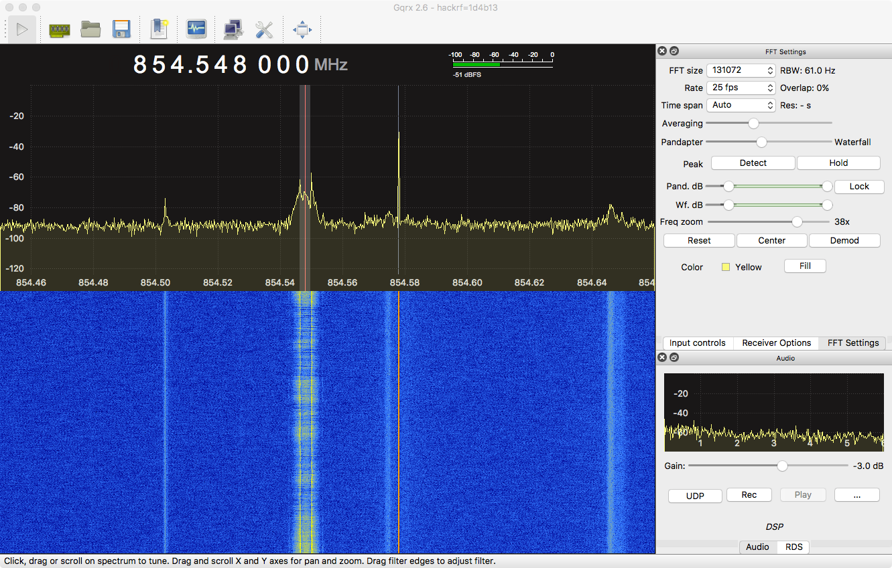

# Configuring Trunk Recorder

It takes a little bit of work to correctly configure Trunk Recorder, but once you get everything working you will not have to touch it again.

## Research

Before you can start entering values, you will need to do a little research about the radio system you are trying to capture and the correct parameters for receiving it. [Radio Reference](http://www.radioreference.com/apps/db/?coid=1) is a great place to learn about a radio system. Search for your location and then select the system you are trying to record. Take note of the frequencies that the system uses. You will want to make sure you can cover the range of frequencies used with one or more SDRs. Also look at the System Type, which tells you if it is a Trunked system and what type it is. For Trunked systems, you will need to write down the control channels, and alternate control channels.

### Frequency



The next step is to try and receive the control channel for the trunked system, using [GQRX](http://gqrx.dk/). GQRX visualizes what your SDR is receiving and makes it easy to fine-tune the system and associated spectrum. While the system you are trying to tune in may have a lot of control channels, it is generally only transmitting on one. Type in the different frequencies to look for the active control channel. Control channels are always broadcasting, and show up as a persistent line on the waterfall graph.

There is a chance that when you tune to the active control channel, it will actually be a few thousand Hz above or below the frequency you tuned to. This is because the tuners on some SDRs are not super accurate and have frequency drifting. Click on the transmission to get the frequency that your SDR thinks it is at.

If so, Trunk Recorder needs to know the amount of tuning error for your SDR in order to successfully tune-in to transmissions. To calculate this, take frequency that the SDR was tuned to... for example 854.548MHz, and subtract the actual frequency for the channel, 854.5625MHz.

`854.548 - 854.5625 = -0.0145 MHz`

You then have to convert that from MHz to Hz, so multiply your answer by 1,000,000:

`-0.0145 * 1000000 = -14500 Hz`

The amount of tuning error is -14500Hz, so that would go under **error:** for this *source* in the `config.json` file.

**NOTE:** In some instances, an alternative is to use `ppm` correction rather than the `error` configuration option.

Alternatively, you can use these tools here: https://webby.site/sdr/ or  http://garvas.org/trunk-recorder/ to obtain RTL-SDR dongle/array configurations.

### Gain

After you have figured out the amount of tuning error, you now need to find the optimal amount of receiver gain to use.

Gain is a measure of how much amplification is required for the received signal, and on some SDRs, there are multiple places along the receive path where a signal can be amplified.

If there is not enough gain, the signal will not be strong enough to decode, and Trunk-Recorder will fail to lock to the control channel. If there is too much gain, it can distort the signal, there is also the chance you might be causing harm to your SDR reception device. Setting the gain too high will result in amplification of the background RF and create noise.

Generally, you can mess around with the gain slider in GQRX until the signal looks well defined and there isn't too much noise. If it is impossible to get a well-defined signal, it could be a sign that you have one or more issues: a better antenna that is tuned to the needed frequency range, moving the antenna to a new location, or using a different SDR device. There could also be some strong interference nearby, which can introduce a lot of background noise making it tough to distinguish the signal. Various computer hardware, poorly grounded hardware, and cheaply made USB hubs can be notorious for producing RF noise across the entire spectrum.

Once you find the correct gain settings, use them for this source in the `config.json` file.

### Center Frequency
When you set the center frequency for a source, **you are picking the frequency that will be in the _middle_ of the block of spectrum that you are recording**. Half of the bandwidth for the device will be above that frequency and the other half below.

For example, if you are using a HackRF, with 8MHz of bandwidth, and you tune the center frequency to 854MHz, it would cover from 850.0MHz to 858.0MHz.

To find your ideal center frequency, look at what the lowest frequency you want to cover is and what the highest is. You need to need to be able cover slightly beyond the frequncy of a channel. This is because the frequency is for the center of the channel and the actual channel is wider and a bit of filtering is done to receive it. The sample rate should be higher than the difference between the low and high frequency. Most SDRs do not perform as well right at the beginnging and end of the frequency range they are set to. It is best to set a slightly higher sample rate than needed, to avoid those spots. Also, some SDRs have some artifacts right at there center frequency, so ensure that center frequency doesn't land on the frequency of a channel you are trying to record. <!-- need to add the amount TR cuts off on either side in sources.cc -->

### Multiple Sources
If the low frequency and high frequency of the system you are trying to capture is greater than the amount of bandwidth your SDR can capture, you need to use multiple SDRs.

In addition to being able to use a cheaper SDR, it also helps with general performance of the devices. When a single SDR is used, each of the Recorders gets fed all of the sampled signals. Each Recorder needs to cut down the multi-mega samples per second into a small 12.5Khz or even 6.25Khz(!) slivers.

When you use multiple SDRs, each SDR is capturing only a partial slice of the system so the recorders have to cut down a much smaller amount of sample to get to the sliver they are interested in. This ultimately denotes that you can have a lot more recorders running!

To use multiple SDRs, simply define additional Sources in the Source array. The config-multi-rtl.json.sample has an example of how to do this. In order to tell the different SDRs apart and make sure they get the right error correction value, give them a serial number using the `rtl_eeprom -s` command and then specifying that number in the device setting for that Source, `rtl=2`.

---

## The config.json file

Trunk Recorder is configured using a JSON formatted file. It defines the SDRs that are available and the trunk system that will be recorded. Trunk Recorder will look for a *config.json* file in the same directory as it is being run in. You can point it to a different config file by using the *--config* argument on the command line, for example: `./trunk-recorder --config=examples/config-wmata-rtl.json`. The following is an example for my local system in DC, using an Ettus B200:

```json
{
  "ver": 2,
  "sources": [{
    "center": 857000000.0,
    "rate": 8000000.0,
    "error": 0,
    "gain": 40,
    "antenna": "TX/RX",
    "digitalRecorders": 2,
    "driver": "usrp",
    "device": ""
  }],
  "systems": [{
    "control_channels": [855462500],
    "type": "p25",
    "talkgroupsFile": "ChanList.csv",
    "unitTagsFile": "UnitTags.csv",
    "squelch": -50,
    "modulation": "qpsk"
  }]
}
```


Here is a map of the different sections of the *config.json* file:

```json
{
  Global Configs

  "sources": [{ Source Object }, { Source Object }],
  "systems": [{ System Object }, { System Object }],
  "plugins": [{ Plugin Object }]
}
```

There is a list of available Plugins [here](./Plugins.md).

### Global Configs


| Key                          | Required | Default Value                                    | Type                                                         | Description                                                  |
| ---------------------------- | :------: | ------------------------------------------------ | ------------------------------------------------------------ | ------------------------------------------------------------ |
| ver                          |    ✓     |                                                  | number                                                       | The version of formatting for the config file. **This should be set to 2**. Trunk Recorder will not start without this set. |
| sources                      |    ✓     |                                                  | array of JSON objects<br />[{}]                              | An array of JSON formatted [Source Objects](#source-object) that define the different SDRs available. Source Objects are described below. |
| systems                      |    ✓     |                                                  | array of JSON objects<br />[{}]                              | An array of JSON formatted [System Objects](#system-object) that define the trunking systems that will be recorded. System Objects are described below. |
| plugins                      |          |                                                  | array of JSON objects<br />[{}]                              | An array of JSON formatted [Plugin Objects](#plugin-object) that define the different plugins to use. Refer to the [Plugin System](notes/PLUGIN-SYSTEM.md) documentation for more details. |
| defaultMode                  |          | "digital"                                        | **"analog"** or **"digital"**                                | Default mode to use when a talkgroups is not listed in the **talkgroupsFile**. The options are *digital* or *analog*. The default is *digital*. This argument is global and not system-specific, and only affects `smartnet` trunking systems which can have both analog and digital talkpaths. |
| tempDir                      |          | /dev/shm *(if available)* else current directory | string                                                       | The complete path to the directory where individual Transmissions are recorded, prior to be combined into a single file. It is best to use memory based file system for this. |
| captureDir                   |          | current directory                                | string                                                       | The complete path to the directory where recordings should be saved. |
| callTimeout                  |          | 3                                                | number                                                       | A Call will stop recording and save if it has not received anything on the control channel, after this many seconds. |
| uploadServer                 |          |                                                  | string                                                       | The URL for uploading to OpenMHz. The default is an empty string. See the Config tab for your system in OpenMHz to find what the value should be. |
| broadcastifyCallsServer      |          |                                                  | string                                                       | The URL for uploading to Broadcastify Calls. The default is an empty string. Refer to [Broadcastify's wiki](https://wiki.radioreference.com/index.php/Broadcastify-Calls-API) for the upload URL. |
| broadcastifySslVerifyDisable |          | false                                            | **true** / **false**                                         | Optionally disable SSL verification for Broadcastify uploads, given their apparent habit of letting their SSL certificate expire |
| consoleLog                   |          | true                                             | **true** / **false**                                         | Send logging output to the console                           |
| logFile                      |          | false                                            | **true** / **false**                                         | Send logging output to a file                                |
| logDir                       |          | logs/                                            | string                                                       | Where the output logs should be put                          |
| frequencyFormat              |          | "exp"                                            | **"exp" "mhz"** or **"hz"**                                  | the display format for frequencies to display in the console and log file. |
| controlWarnRate              |          | 10                                               | number                                                       | Log the control channel decode rate when it falls bellow this threshold. The value of *-1* will always log the decode rate. |
| controlRetuneLimit           |          | 0                                                | number                                                       | Number of times to attempt to retune to a different control channel when there's no signal. *0* means unlimited attemps. The counter is reset when a signal is found. Should be at least equal to the number of channels defined in order for all to be attempted. |
| statusAsString               |          | true                                             | **true** / **false**                                         | Show status as strings instead of numeric values             |
| statusServer                 |          |                                                  | string                                                       | The URL for a WebSocket connect. Trunk Recorder will send JSON formatted update message to this address. HTTPS is currently not supported, but will be in the future. OpenMHz does not support this currently. [JSON format of messages](./notes/STATUS-JSON.md) |
| broadcastSignals             |          | true                                             | **true** / **false**                                         | Broadcast decoded signals to the status server.              |
| logLevel                     |          | "info"                                           | **"trace"**, **"debug"**, **"info"**, **"warning"**, **"error"** or **"fatal"** | the logging level to display in the console and log file. The options are *trace*, *debug*, *info*, *warning*, *error* & *fatal*. The default is *info*. |
| debugRecorder                |          | true                                             | **true** / **false**                                         | Will attach a debug recorder to each Source. The debug recorder will allow you to examine the channel of a call be recorded. There is a single Recorder per Source. It will monitor a recording and when it is done, it will monitor the next recording started. The information is sent over a network connection and can be viewed using the `udp-debug.grc` graph in GnuRadio Companion |
| debugRecorderPort            |          | 1234                                             | number                                                       | The network port that the Debug Recorders will start on. For each Source an additional Debug Recorder will be added and the port used will be one higher than the last one. For example the ports for a system with 3 Sources would be: 1234, 12345, 1236. |
| debugRecorderAddress         |          | "127.0.0.1"                                      | string                                                       | The network address of the computer that will be monitoring the Debug Recorders. UDP packets will be sent from Trunk Recorder to this computer. The default is *"127.0.0.1"* which is the address used for monitoring on the same computer as Trunk Recorder. |
| audioStreaming               |          | false                                            | **true** / **false**                                         | Whether or not to enable the audio streaming callbacks for plugins. |
| newCallFromUpdate            |          | true                                             | **true** / **false**                                         | Allow for UPDATE trunking messages to start a new Call, in addition to GRANT messages. This may result in more Calls with no transmisions, and use more Recorders. The flipside is that it may catch parts of a Call that would have otherwise been missed. Turn this off if you are running out of Recorders. |
| softVocoder                  |          | false                                            | **true** / **false**                                         | Use the Software Decode vocoder from OP25 for Phase 1 audio. Give it a try if you are hearing weird tones in your audio. Whether it makes your audio sound better or worse is a matter of preference. |


#### Source Object

| Key              | Required | Default Value | Type                        | Description                                                  |
| :--------------- | :------: | :-----------: | --------------------------- | ------------------------------------------------------------ |
| center           |    ✓     |               | number                      | The center frequency in Hz to tune the SDR to                |
| rate             |    ✓     |               | number                      | The sampling rate to set the SDR to, in samples / second     |
| error            |          |       0       | number                      | The tuning error for the SDR, in Hz. This is the difference between the target value and the actual value. So if you wanted to recv 856MHz but you had to tune your SDR to 855MHz (when set to 0ppm)  to actually receive it, you would set this to -1000000. You should also probably get a new SDR if it is off by this much. |
| gain             |    ✓     |               | number                      | The RF gain setting for the SDR. Use a program like GQRX to find a good value. |
| digitalRecorders |          |               | number                      | The number of Digital Recorders to have attached to this source. This is essentially the number of simultaneous calls you can record at the same time in the frequency range that this Source will be tuned to. It is limited by the CPU power of the machine. Some experimentation might be needed to find the appropriate number. *This is only required for Trunk systems. Channels in Conventional systems have dedicated recorders and do not need to be included here.* |
| analogRecorders  |          |               | number                      | The number of Analog Recorder to have attached to this source. The same as Digital Recorders except for Analog Voice channels. *This is only required for Trunk systems. Channels in Conventional systems have dedicated recorders and do not need to be included here.* |
| driver           |    ✓     |               | **"usrp"** or **"osmosdr"** | The GNURadio block you wish to use for the SDR.              |
| device           |          |               | **string**<br /> See the [osmosdr page](http://sdr.osmocom.org/trac/wiki/GrOsmoSDR) for supported devices and parameters. | Osmosdr device name and possibly serial number or index of the device. <br /> You only need to do add this key if there are more than one osmosdr devices being used.<br /> Example: `bladerf=00001` for BladeRF with serial 00001 or `rtl=00923838` for RTL-SDR with serial 00923838, just `airspy` for an airspy.<br />It seems that when you have 5 or more RTLSDRs on one system you need to decrease the buffer size. I think it has something to do with the driver. Try adding buflen: `"device": "rtl=serial_num,buflen=65536"`, there should be no space between the comma and `buflen`. |
| ppm              |          |       0       | number                      | The tuning error for the SDR in ppm (parts per million), as an alternative to `error` above. Use a program like GQRX to find an accurate value. |
| agc              |          |     false     | **true** / **false**        | Whether or not to enable the SDR's automatic gain control (if supported). This is false by default. It is not recommended to set this as it often yields worse performance compared to a manual gain setting. |
| gainSettings     |          |               | { "stageName": value}       | Set the gain for any stage. The value for this setting should be passed as an object, where the key specifies the name of the gain stage and the value is the amount of gain, as an int. For example:<br /> ````"gainSettings": { "IF": 10, "BB": 11},```` |
| ifGain           |          |               | number                      | *AirSpy/hackrf only* sets the **IF** gain.                   |
| bbGain           |          |               | number                      | *hackrf only* sets the **BB** gain.                          |
| mixGain          |          |               | number                      | *AirSpy only* sets the **MIX** gain.                         |
| lnaGain          |          |               | number                      | *AirSpy/bladeRF only* sets the **LNA** gain.                 |
| vga1Gain         |          |               | number                      | *bladeRF only* sets the **VGA1** gain.                       |
| vga2Gain         |          |               | number                      | *bladeRF only* sets the **VGA2** gain.                       |
| antenna          |          |               | string, e.g.: **"TX/RX"**   | *usrp only* selects which antenna jack to use                |
| enabled          |          |     true      | **true** / **false**        | control whether a configured source is enabled or disabled   |


#### System Object

| Key                    | Required | Default Value              | Type                                                                         | Description                                                  |
| ---------------------- | :------: | -------------------------- | ---------------------------------------------------------------------------- | ------------------------------------------------------------ |
| shortName              |    ✓     |                            | string                                                                       | This is a nickname for the system. It is used to help name and organize the recordings from this system. It should be 4-6 letters with no spaces. |
| type                   |    ✓     |                            | **"smartnet"**, **"p25"**, **"conventional"**, **"conventionalDMR"** or **"conventionalP25"** | The type of radio system.                                    |
| control_channels       |    ✓     |                            | array of numbers;<br />[496537500, 496437500]                                | *For trunked systems* The control channel frequencies for the system, in Hz. The frequencies will automatically be cycled through if the system moves to an alternate channel. |
| channels               |    ✓     |                            | array of numbers;<br />[166725000, 166925000, 167075000, 166850000]          | *For conventional systems*  The channel frequencies, in Hz, used for the system. The channels get assigned a virtual talkgroup number based upon their position in the array. Squelch levels need to be specified for the Source(s) being used. |
| channelFile            |    ✓     |                            | string                                                                       | *For conventional systems* The filename for a CSV file that provides information about the conventional channels. The format for the file is described below. Squelch levels need to be specified for the Source(s) being used. *Use channels or channelFile, not both*. |
| modulation             |          | "qpsk"                     | **"qpsk"** or  **"fsk4"**                                                    | The type of digital modulation that the system uses. You do not need to specify this with **conventionalDMR** systems.          |
| squelch                |          | -160                       | number                                                                       | Squelch in DB, this needs to be set for all conventional systems. The squelch setting is also used for analog talkgroups in a SmartNet system. I generally use -60 for my rtl-sdr. The closer the squelch is to 0, the stronger the signal has to be to unmute it. |
| talkgroupsFile         |          |                            | string                                                                       | The filename for a CSV file that provides information about the talkgroups. It determines whether a talkgroup is analog or digital, and what priority it should have. This file should be located in the same directory as the trunk-recorder executable. |
| apiKey                 |          |                            | string                                                                       | *if uploadServer is set* System-specific API key for uploading calls to OpenMHz.com. See the Config tab for your system in OpenMHz to find what the value should be. |
| broadcastifyApiKey     |          |                            | string                                                                       | *if broadcastifyCallsServer is set* System-specific API key for Broadcastify Calls |
| broadcastifySystemId   |          |                            | number                                                                       | *if broadcastifyCallsServer is set* System ID for Broadcastify Calls <br />(this is an integer, and different from the RadioReference system ID) |
| uploadScript           |          |                            | string                                                                       | The filename of a script that is called after each recording has finished. Checkout *encode-upload.sh.sample* as an example. Should probably start with `./` ( or `../`). |
| compressWav            |          | true                       | bool                                                                         | Convert the recorded .wav file to an .m4a file. **This is required for both OpenMHz and Broadcastify!** The `sox` and `fdkaac` packages need to be installed for this command to work. |
| unitScript             |          |                            | string                                                                       | The filename of a script that runs when a radio (unit) registers (is turned on), affiliates (joins a talk group), deregisters (is turned off), gets an acknowledgment response, transmits, gets a data channel grant, a unit-unit answer request or a Location Registration Response. Passed as parameters:  `shortName radioID on\|join\|off\|ackresp\|call\|data\|ans_req\|location`. On joins and transmissions, `talkgroup` is passed as a fourth parameter; on answer requests, the `source` is.  On joins and transmissions, `patchedTalkgroups`  (comma separated list of talkgroup IDs) is passed as a fifth parameter if the talkgroup is part of a patch on the system. See *examples/unit-script.sh* for a logging example. Note that for paths relative to trunk-recorder, this should start with `./`( or `../`). |
| audioArchive           |          | true                       | **true** / **false**                                                         | Should the recorded audio files be kept after successfully uploading them? |
| transmissionArchive    |          | false                      | **true** / **false**                                                         | Should each of the individual transmission be kept? These transmission are combined together with other recent ones to form a single call. |
| callLog                |          | true                       | **true** / **false**                                                         | Should a json file with the call details be kept after successful uploads? |
| analogLevels           |          | 8                          | number (1-32)                                                                | The amount of amplification that will be applied to the analog audio. |
| maxDev                 |          | 4000                       | number                                                                       | The maximum deviation for analog channels. If you analog recordings sound good or if you have a completely digital system, then there is no need to touch this. |
| digitalLevels          |          | 1                          | number (1-16)                                                                | The amount of amplification that will be applied to the digital audio. |
| unitTagsFile           |          |                            | string                                                                       | The filename of a CSV file that provides information about the unit tags. The format for the file is described below. |
| recordUnknown          |          | true                       | **true** / **false**                                                         | Record talkgroups if they are not listed in the Talkgroups File. |
| recordUUVCalls         |          | true                       | **true** / **false**                                                         | *P25 only* Record Unit to Unit Voice calls.        |
| hideEncrypted          |          | false                      | **true** / **false**                                                         | Hide encrypted talkgroups log entries                        |
| hideUnknownTalkgroups  |          | false                      | **true** / **false**                                                         | Hide unknown talkgroups log entries                          |
| minDuration            |          | 0<br />(which is disabled) | number                                                                       | The minimum call duration in seconds (decimals allowed), calls below this number will have recordings deleted and will not be uploaded. |
| minTransmissionDuration|          | 0<br />(which is disabled) | number                                                                       | The minimum transmission duration in seconds (decimals allowed), transmissions below this number will not be added to their corresponding call. |
| maxDuration            |          | 0<br />(which is disabled) | number                                                                       | The maximum call duration in seconds (decimals allowed), calls above this number will have recordings split into multiple parts. |
| talkgroupDisplayFormat |          | "id"                       | **"id" "id_tag"** or **"tag_id"**                                            | The display format for talkgroups in the console and log file. (*id_tag* and *tag_id* is only valid if **talkgroupsFile** is specified) |
| bandplan               |          | "800_standard"             | **"800_standard"**, **"800_reband"**, **"800_splinter"** or **"400_custom"** | *SmartNet only* The SmartNet bandplan that will be used. |
| bandplanBase           |          |                            | number                                                                       | *400_custom only* The base frequency, specified in Hz. |
| bandplanHigh           |          |                            | number                                                                       | *SmartNet, 400_custom only* The highest channel in the system, specified in Hz. |
| bandplanSpacing        |          |                            | number                                                                       | *SmartNet, 400_custom only* The channel spacing, specified in Hz. Typically this is *25000*. |
| bandplanOffset         |          |                            | number                                                                       | *SmartNet, 400_custom only* The offset used to calculate frequencies. |
| decodeMDC              |          | false                      | **true** / **false**                                                         | *Conventional systems only* enable the MDC-1200 signaling decoder. |
| decodeFSync            |          | false                      | **true** / **false**                                                         | *Conventional systems only* enable the Fleet Sync signaling decoder. |
| decodeStar             |          | false                      | **true** / **false**                                                         | *Conventional systems only* enable the Star signaling decoder. |
| decodeTPS              |          | false                      | **true** / **false**                                                         | *Conventional systems only* enable the Motorola Tactical Public Safety (aka FDNY Fireground) signaling decoder. |
| enabled                |          | true                       | **true** / **false**                                                         | control whether a configured system is enabled or disabled                 |

#### System Object - Experimental Options

| Key                    | Required | Default Value | Type                 | Description                                                                       |
| ---------------------- | :------: | --------------| ---------------------| --------------------------------------------------------------------------------- |
| multiSite              |          | false         | **true** / **false** | Enables multiSite mode for this system                                            |
| multiSiteSystemName    |          |               | string               | The name of the system that this site belongs to. **This is required for SmartNet in Multi-Site mode.** |
| multiSiteSystemNumber  |          | 0             | number               | An arbitrary number used to identify this system for SmartNet in Multi-Site mode. |

When enabled, Multi-Site mode attempts to avoid recording duplicate calls by detecting simulcasted transmissions for the same talkgroup across multiple sites at the same time.

For P25, Trunk Recorder will match calls that have the same WACN and same talkgroup number but a different NAC. For SmartNet, Trunk Recorder will match calls that have the same multiSiteSystemName and same talkgroup number but different multiSiteSystemNumber.

By default, Trunk Recorder will record the call from the first site to receive the grant and ignore the duplicate grants from the other related sites. If you want to specify the preferred site for a given talkgroup number you can specify the preferred NAC (in decimal format) in the [talkgroupsFile](#talkgroupsFile).

Note: While multiSiteSystemName and multiSiteSystemNumber are normally used for SmartNet systems, these settings may also be used to override the default de-duplication logic for P25 systems where the mutliSite feature may not be correctly detecting duplicates. An example would be when two or more sites within a P25 system are using the same NAC and WACN. In such a deployment as a workaround, for each related system object, set multiSiteSystemName to a shared value and multiSiteSystemNumber to a unique value:

```
{
    ...
    "systems": [
        {
            "type": "P25",
            ...
            "multiSite": "true",
            "multiSiteSystemName": "somesharedname",
            "multiSiteSystemNumber": 1
        },
        {
            "type": "P25",
            ...
            "multiSite": "true",
            "multiSiteSystemName": "somesharedname",
            "multiSiteSystemNumber": 2
        }
    ]
    ...
}
```

#### Plugin Object

| Key     | Required | Default Value | Type                 | Description                                                  |
| ------- | :------: | ------------- | -------------------- | ------------------------------------------------------------ |
| library |    ✓     |               | string               | the name of the library that contains the plugin.            |
| name    |    ✓     |               | string               | the name of the plugin. This name is used to find the `<name>_plugin_new` method that creates a new instance of the plugin. |
| enabled |          | true          | **true** / **false** | control whether a configured plugin is enabled or disabled   |
|         |          |               |                      | *Additional elements can be added, they will be passed into the `parse_config` method of the plugin.* |

##### Rdio Scanner Plugin

**Name:** rdioscanner_uploader
**Library:** librdioscanner_uploader.so

This plugin makes it easy to connect Trunk Recorder with [Rdio Scanner](https://github.com/chuot/rdio-scanner). It uploads recordings and the information about them. The following additional settings are required:

| Key     | Required | Default Value | Type   | Description                                                  |
| ------- | :------: | ------------- | ------ | ------------------------------------------------------------ |
| server  |    ✓     |               | string | The URL for uploading to Rdio Scanner. The default is an empty string. It should be the same URL as the one you are using to access Rdio Scanner. |
| systems |    ✓     |               | array  | This is an array of objects, where each is a system that should be passed to Rdio Scanner. More information about what should be in each object is in the following table. |

*Rdio Scanner System Object:*

| Key       | Required | Default Value | Type   | Description                                                  |
| --------- | :------: | ------------- | ------ | ------------------------------------------------------------ |
| systemId  |    ✓     |               | number | System ID for Rdio Scanner.                                  |
| apiKey    |    ✓     |               | string | System-specific API key for uploading calls to Rdio Scanner. See the ApiKey section in the Rdio Scanner administrative dashboard for the value it should be. |
| shortName |    ✓     |               | string | This should match the shortName of a system that is defined in the main section of the config file. |


##### Example Plugin Object:

```yaml
        {
          "name": "rdioscanner_uploader",
          "library": "librdioscanner_uploader.so",
          "server": "http://127.0.0.1",
          "systems": [{
                  "shortName": "test",
                  "apiKey": "fakekey",
                  "systemId": 411
          }
```

##### simplestream Plugin

**Name:** simplestream
**Library:** libsimplestream.so

This plugin streams uncompressed audio (16 bit Int, 8 kHz, mono) to UDP or TCP ports in real time as it is being recorded by trunk-recorder.  It can be configured to stream audio from all talkgroups and systems being recorded or only specified talkgroups and systems.  TGID information can be prepended to the audio data to allow the receiving program to take action based on the TGID.  Audio from different Systems should be streamed to different UDP/TCP ports to prevent crosstalk and interleaved audio from talkgroups with the same TGID on different systems.

This plugin does not, by itself, stream audio to any online services.  Because it sends uncompressed PCM audio, it is not bandwidth efficient and is intended mostly to send audio to other programs running on the same computer as trunk-recorder or to other computers on the LAN.  The programs receiving PCM audio from this plugin may play it on speakers, compress it and stream it to an online service, etc.

**NOTE 1: In order for this plugin to work, the audioStreaming option in the Global Configs section (see above) must be set to true.**

**NOTE 2: trunk-recorder passes analog audio to this plugin at 16 kHz sample rate and digital audio at 8 kHz sample rate.  Since the audio data being streamed doesn't contain the sample rate, analog and digital audio should be configured to be sent to different ports to receivers that are matched to the same sample rate.**

| Key     | Required | Default Value | Type   | Description                                                  |
| ------- | :------: | ------------- | ------ | ------------------------------------------------------------ |
| streams |    ✓     |               | array  | This is an array of objects, where each is an audio stream that will be sent to a specific IP address and UDP port. More information about what should be in each object is in the following table. |

*Audio Stream Object:*

| Key       | Required | Default Value | Type                 | Description                                                  |
| --------- | :------: | ------------- | -------------------- | ------------------------------------------------------------ |
| address   |    ✓     |               | string               | IP address to send this audio stream to.  Use "127.0.0.1" to send to the same computer that trunk-recorder is running on. |
| port      |    ✓     |               | number               | UDP or TCP port that this stream will send audio to.         |
| TGID      |    ✓     |               | number               | Audio from this Talkgroup ID will be sent on this stream.  Set to 0 to stream all recorded talkgroups. |
| sendTGID  |          |     false     | **true** / **false** | When set to true, the TGID will be prepended in long integer format (4 bytes, little endian) to the audio data each time a packet is sent. |
| shortName |          |               | string               | shortName of the System that audio should be streamed for.  This should match the shortName of a system that is defined in the main section of the config file.  When omitted, all Systems will be streamed to the address and port configured.  If TGIDs from Systems overlap, each system must be sent to a different port to prevent interleaved audio for talkgroups from different Systems with the same TGID.
|  useTCP   |          |     false     | **true** / **false** | When set to true, TCP will be used instead of UDP.

###### Plugin Object Example #1:
This example will stream audio from talkgroup 58914 on system "CountyTrunked" to the local machine on UDP port 9123.
```yaml
        {
          "name":"simplestream",
          "library":"libsimplestream.so",
          "streams":[{
            "TGID":58914,
            "address":"127.0.0.1",
            "port":9123,
            "sendTGID":false,
            "shortName":"CountyTrunked"}
        }
```

###### Plugin Object Example #2:
This example will stream audio from talkgroup 58914 from System CountyTrunked to the local machine on UDP port 9123 and stream audio from talkgroup 58916 from System "StateTrunked" to the local machine on UDP port 9124.
```yaml
        {
          "name":"simplestream",
          "library":"libsimplestream.so",
          "streams":[{
            "TGID":58914,
            "address":"127.0.0.1",
            "port":9123,
            "sendTGID":false,
            "shortName":"CountyTrunked"},
           {"TGID":58916,
            "address":"127.0.0.1",
            "port":9124,
            "sendTGID":false,
            "shortName":"StateTrunked"}
          ]}
        }
```

###### Plugin Object Example #3:
This example will stream audio from talkgroups 58914 and 58916 from all Systems to the local machine on the same UDP port 9123.  It will prepend the TGID to the audio data in each UDP packet so that the receiving program can differentiate the two audio streams (the receiver may decide to only play one depending on priority, mix the two streams, play one left and one right, etc.)
```yaml
        {
          "name":"simplestream",
          "library":"libsimplestream.so",
          "streams":[{
            "TGID":58914,
            "address":"127.0.0.1",
            "port":9123,
            "sendTGID":true},
           {"TGID":58916,
            "address":"127.0.0.1",
            "port":9123,
            "sendTGID":true}
          ]}
        }
```
###### Plugin Object Example #4:
This example will stream audio from all talkgroups being recorded on System CountyTrunked to the local machine on UDP port 9123.  It will prepend the TGID to the audio data in each UDP packet so that the receiving program can decide which ones to play or otherwise handle)
```yaml
        {
          "name":"simplestream",
          "library":"libsimplestream.so",
          "streams":[{
            "TGID":0,
            "address":"127.0.0.1",
            "port":9123,
            "sendTGID":true,
            "shortName":"CountyTrunked"}
        }
```
##### Example - Sending Audio to pulseaudio
pulseaudio is the default sound system on many Linux computers, including the Raspberry Pi.  If configured to do so, pulseaudio can accept raw audio via TCP connection using the module-simple-protocol-tcp module.  Each TCP connection will show up as a different "application" in the pavucontrol volume mixer.

An example command to set up pulseaudio to receive 8 kHz digital audio from simplestream on TCP port 9125 (for 16 kHz analog audio, use `rate=16000`):
```
pacmd load-module module-simple-protocol-tcp sink=1 playback=true port=9125 format=s16le rate=8000 channels=1
```
The matching simplestream config to send audio from talkgroup 58918 to TCP port 9125 would then be something like this:
```yaml
        {
          "name":"simplestream",
          "library":"libsimplestream.so",
          "streams":[{
            "TGID":58918,
            "address":"127.0.0.1",
            "port":9125,
            "sendTGID":false,
            "shortName":"CountyTrunked",
            "useTCP":true}
        }
```

## talkgroupsFile

This file provides info on the different talkgroups in a trunking system. A lot of this info can be found on the [Radio Reference](http://www.radioreference.com/) website. You need to be a Radio Reference member to download the table for your system preformatted as a CSV file. You can also try clicking on the "List All in one table" link, selecting everything in the table and copying it into a spreadsheet program, and then exporting or saving as a CSV file.

**Note:** You can use the direct CSV from Radio Reference for talk groups. You will need to add the Priority column if you are going to be using that.

A Header row is required on the first line of the CSV file. The supported column names are: "Decimal", "Mode", "Description","Alpha Tag", "Hex", "Category", "Tag", "Priority", "Preferred NAC"

The first column must be the "Decimal" column.

The columns are:

| Column Name | Required | Value |
|-------------|----------|-------|
| Decimal     | ✔️        | The Talkgroup Number formatted as a decimal number. |
| Mode        |  ✔️       | Mode defines the type of transmission broadcast on this talkgroup. Analog transmissions are standard voice, Digital and TDMA transmissions are digitally modulated. <br />A = Analog Talkgroup<br />D = Digital Talkgroup<br />M = Mixed Analog/Digital<br />T = TDMA Capable Talkgroup<br />--<br />A trailing lowercase e represents partial encryption. A trailing uppercase E represents full encryption. |
| Description | ✔️        | The description of the talkgroup |
| Alpha Tag |       | A 16 character description that is intended as a shortened display on radio displays |
| Hex       |       | The Talkgroup Number formatted as a hex number. This value is currently not used. |
| Category |    |  The category for the Talkgroup |
| Tag       |   |  The Service Tag for the Talkgroup |
| Priority |    | The priority field specifies the number of recorders the system must have available to record a new call for the talkgroup. For example, a priority of 1, the highest means as long as at least a single recorder is available, the system will record the new call. If the priority is 2, the system would at least 2 free recorders to record the new call, and so on. If there is no priority set for a talkgroup entry, a prioity of 1 is assumed. <br/> Talkgroups assigned a priority of -1 will never be recorded, regardless of the number of available recorders. |
| Preferred NAC |     | In Multi-Site mode, the preferred NAC for a specific talk group is used to specify the site you prefer the talk group to be recorded from.|
| Comment |        | Use this field to capture comments about a talkgroup. It will be ignored by Trunk Recorder. |

Here are the column headers and some sample data: 

| Decimal | Hex | Mode | Alpha Tag    | Description    | Tag            | Category    | Priority | Preferred NAC |
|-----|-----|------|--------------|----------------|----------------|----------|----------|-------------------------|
|101  | 065 | D    | DCFD 01 Disp | 01 Dispatch    | Fire Dispatch  | Fire     | 1        | 1000                    |
|2227 | 8b3 | D    | DC StcarYard | Streetcar Yard | Transportation | Services | 3        | 1001                    |


## channelFile

This file allows for you to specify additional information about conventional channels. A recorder is started for each line in the file and set the to frequency specified. The type of recorder is based on the type of System. A **Conventional** system would have Analog Recorders, while **ConventionalP25** or **ConventionalDMR** would have digital recorders.

*Tone based squelch is currently not supported.*


| Column Name | Required | Value |
|-------------|----------|-------|
| TG Number     | ✔️        | The Talkgroup Number formatted as a decimal number. This has to be the first column |
| Frequency        |  ✔️       | The frequency in Hz for the channel |
| Tone | ✔️        | The Tone for the talkgroup. This value is not used. *Tone based squelch is currently not supported.* |
| Alpha Tag |       | A 16 character description that is intended as a shortened display on radio displays |
| Category |    |  The category for the Talkgroup |
| Tag       |   |  The Service Tag for the Talkgroup |
| Comment |        | Use this field to capture comments about a talkgroup. It will be ignored by Trunk Recorder. |
| Enable |        | Set to 'false' if you do not want this talkgroup/channel to created |


The **Enable** Column is optional and defaults to *True*. It only needs to be added to rows that you do not want to have recorded. For those rows, set **Enable** to *False*.

| TG Number | Frequency | Tone     | Alpha Tag     | Description            | Tag    | Category  | Enable (*optional*) |
| --------- | --------- | -------- | ------------- | ---------------------- | ------ | ------ | ------------------- |
| 300       | 462275000 | 94.8  | Town A Police | Town A Police Dispatch | Police | Town A |                     |
| 325       | 462275000 | 151.4 | Town B DPW    | Town B Trash Dispatch  | DPW    | Town B | False               |


## unitTagsFile

This file allows for Unit IDs to be assigned a name. The format is 2 columns, the first being the decimal number of the Unit ID, the second is the Unit Name.

Regex is also supported for the Unit ID, which can be used to match radio IDs of a specific pattern. By default, the regex must match the full string (`^pattern$`), however putting the pattern within `/` will allow partial matches. Within the unit name, `$1`, `$2`, etc. will be replaced by the corresponding capture group. For large radio systems, regex may be better instead of specifying a long list of radio IDs. In case a Unit ID will be matched by regex but you do not want to use the associated unit name, you can put the specific unit ID and unit name before the regex, so it will be chosen before reaching the regex.

In the second row of the example below, the first capture group `([0-9]{2})` becomes `$1` for the unit name, so an ID like 1210207 gets translated to Engine 20. In the third row, only the start of the string is being matched, so an ID of 173102555 is translated into Ambulance 102.

| Unit ID                  | Unit Name    |
| ---------                | ---------    |
| 911000                   | Dispatch     |
| 1[1245]10([0-9]{2})[127] | Engine $1    |
| /^1[78]3(1[0-9]{2})/     | Ambulance $1 |
