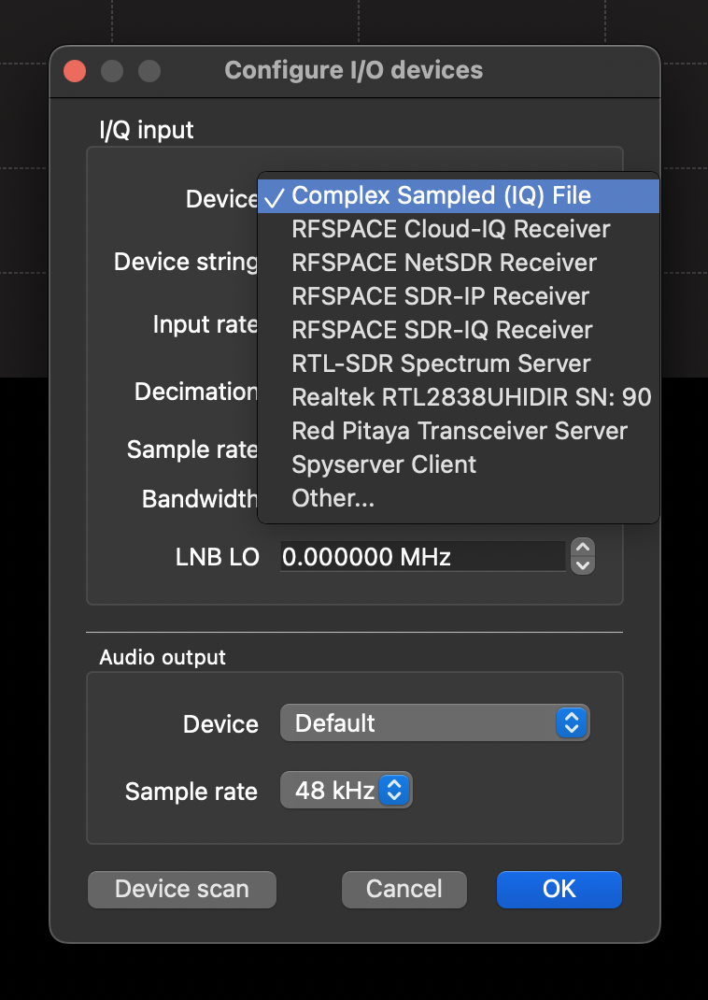

# How to Debug a Seg Fault

When Trunk Recorder crashes and give a Segmentation Fault error (a SegFault), there are some steps you can take to figure out what is causing it. Pulling this information makes it a lot easier to figure what is going wrong.

1. In the terminal where you are going to be running Trunk Recorder, change the limit on Core Dumps, which lets Linux record what was happening at the time of the crash:
```bash
ulimit -c unlimited
```

2. Next, rebuild Trunk Recorder with extra debug information information include. To do this, add `-DCMAKE_BUILD_TYPE=Debug` to the **cmake** command as part of the build process. After you do that, run `make` again. For example, if your build directory was in the Trunk Recorder directory, run:
```bash
cmake -DCMAKE_BUILD_TYPE=Debug ../
make
```

3. Before you start Trunk Recorder, delete any old **core** files that may be in the directory.

4. Startup Trunk Recorder and wait for a crash...

5. After a crash, use the **gdb** program to unpack the **core** file that was generated during the crash.
```bash
gdb trunk-recorder core
```

6. *gdb* is a powerful debugging platform. However, all we need is a trace of the crash. After *gdb* has finished loading, type in `bt full` to get a trace. Copy all of the output from *gdb* into a new [GitHub Issue](https://github.com/robotastic/trunk-recorder/issues/new), along with as much information as possible on what maybe casuing the crash.


# How to Capture an IQ Sample

When you are testing and debugging, it can be helpful to have recordings of different types of radio systems and transmissions. IQ is the raw data format that comes from an SDR. You can record this to disk and then play it back later or share it to help other debug your problem.

## Recording off an RTL-SDR

RTL-SDRs have a built in program for capturing IQ samples. If you have install the `rtl-sdr` package, it comes with the `rtl_sdr` program. 

```bash
rtl_sdr, an I/Q recorder for RTL2832 based DVB-T receivers

Usage:	 -f frequency_to_tune_to [Hz]
	[-s samplerate (default: 2048000 Hz)]
	[-d device_index (default: 0)]
	[-g gain (default: 0 for auto)]
	[-p ppm_error (default: 0)]
	[-b output_block_size (default: 16 * 16384)]
	[-n number of samples to read (default: 0, infinite)]
	[-S force sync output (default: async)]
	filename (a '-' dumps samples to stdout)
```

Use the settings from the source you are interested in from your config.json file. For example to record:

```json
    "sources": [ {
        "center": 855700000,
        "rate": 2048000,
        "error": 0,
        "gain": 39,
        "digitalRecorders": 4,
        "driver": "osmosdr",
        "device": "rtl=41"
    } ]
```

you would use: `rtl_sdr -f 855700000 -s 2048000 -g 39 -d 41 debug.iq`

The file that rtl_sdr generates is in a compact format... which is great but it can't easily be opened by other program. There is a good write-up on it from here (from 2014!). Luckily, some wrote a small program to convert it into a more standard format (complex IQ). I have included it in the /utils folder: [rtlsdr-to-iq.c](https://github.com/robotastic/trunk-recorder/blob/master/utils/rtlsdr-to-iq.c). Compile the program and then copy it to the directory with your recordings and run it against them. Note - the conversion will cause the filesize to increase 4x, so make sure you have enough space.


## Playback in GQRX

GQRX can playback files that are in the IQ Complex format. In GQRX, select IQ File as the source:


You are then going to need a device string with the correct options. Update this to match where your file is and its parameters:

`file=/Users/luke/Projects/TrunkRecorder/debug.iq,freq=855700000,rate=2048000,repeat=true,throttle=true`

## Playing an IQ File as a Source in Trunk Recorder

Check out the [config-iq-file.json](https://github.com/robotastic/trunk-recorder/blob/master/examples/config-iq-file.json) config as an example of how to playback an IQ file as a Source. You will probably need to have the `repeat` parameter turned on, unless you have a really long file. 