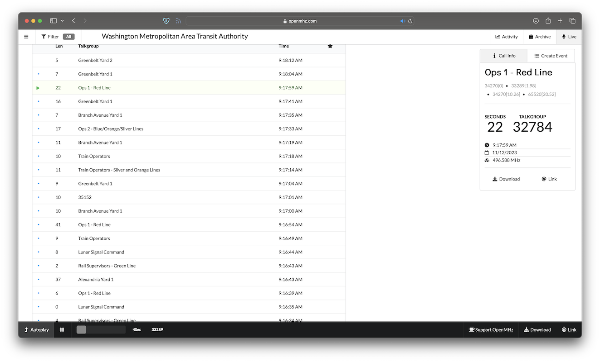
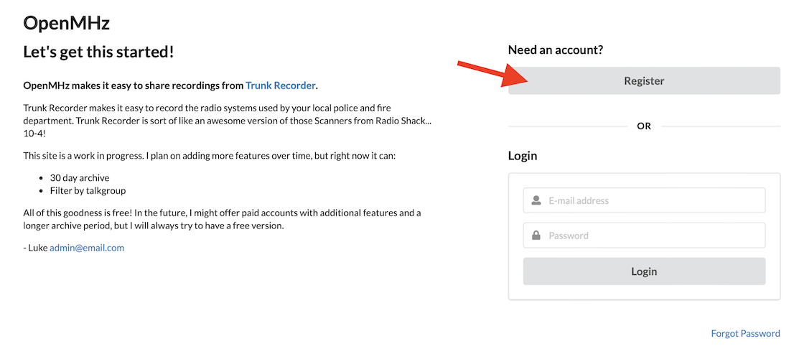
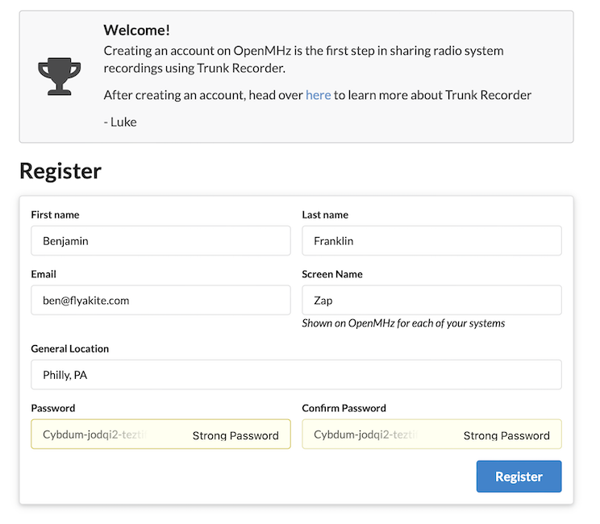
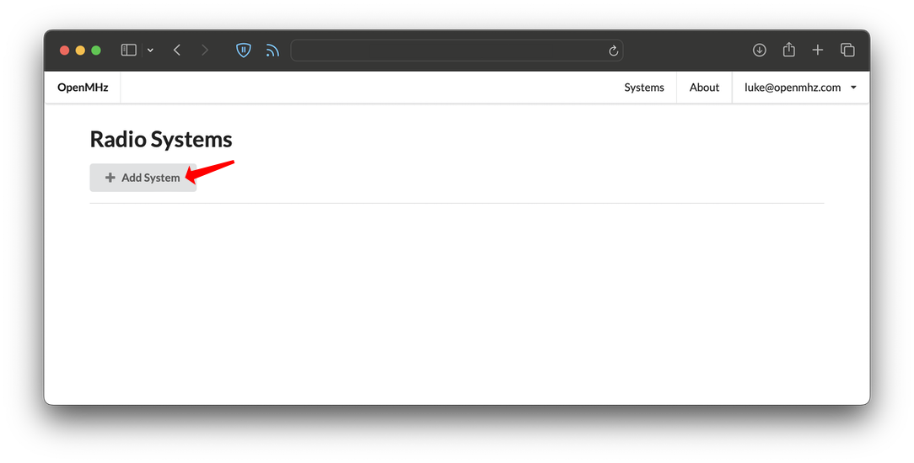
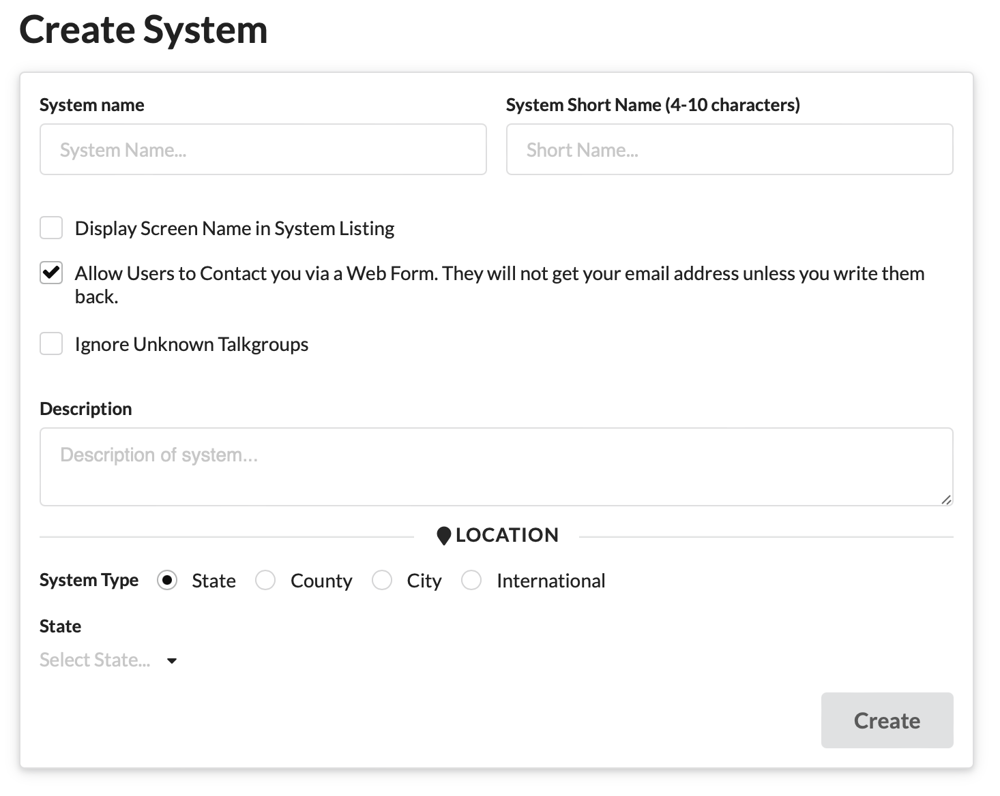
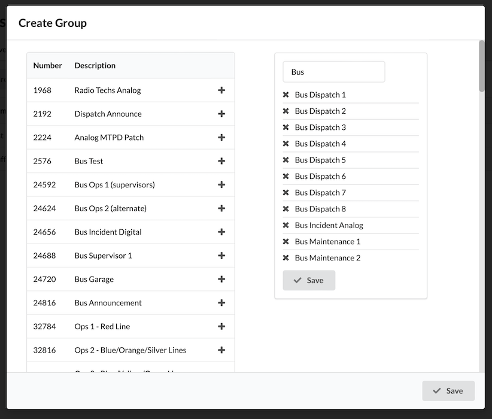
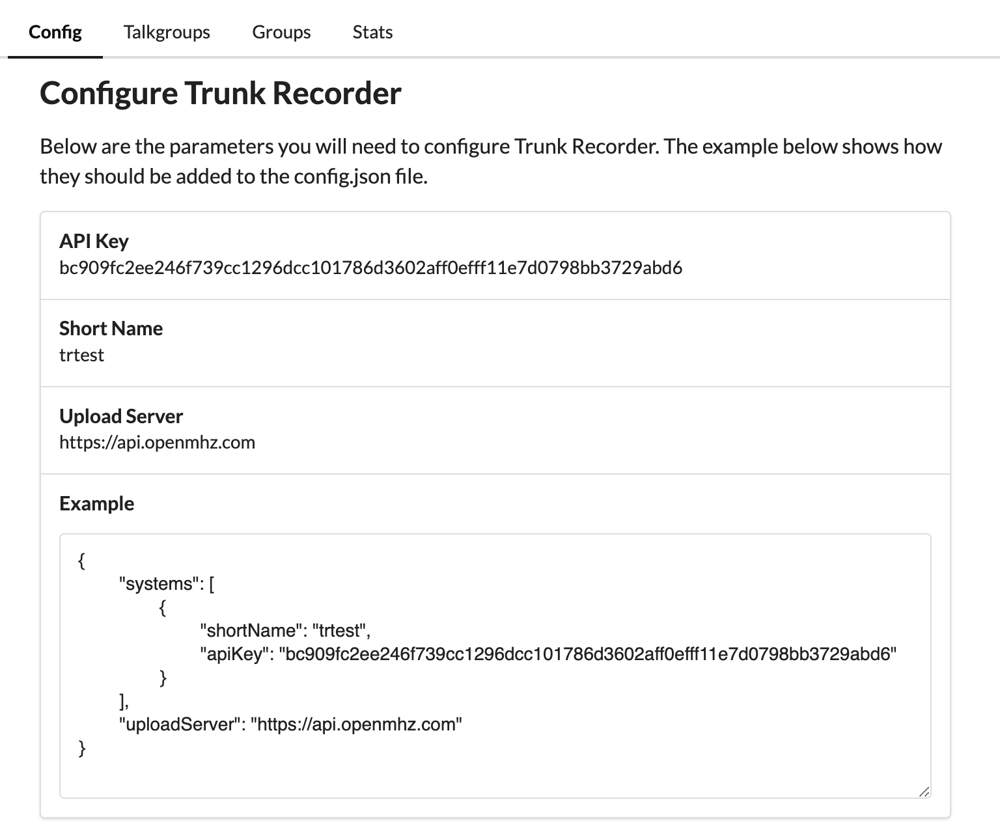

# OpenMHz


[OpenMHz](https://openmhz.com) is free website run by the author of Trunk Recorder that makes it easy to share and listen to recordings. The past 30 days of transmissions are archived, make it easy to go back and listen to an event. Interesting calls can be grouped together into and event and downloaded.

## Contributing
Once you have Trunk Recorder setup, it is easy to begin contributing recordings to OpenMHz. There is a built in uploader in Trunk Recorder that can upload Calls after they have been captured. Go through the following steps to create a System on OpenMHz and configure Trunk Recorder:

### Create a User Account
To get started, you need to create a User Account on OpenMHz. Go to [https://account.openmhz.com/](https://account.openmhz.com/) and click on the **Register** button.


Now fill in your user information. Note that the **email** address you provide has to be a real address that you need to confirm and should be one that you check occasionally.


Go check your emails - in a few minutes you should get an email from OpenMHz with a link to click on to confirm your email address. 

### Create an OpenMHz System

Great work! You have created a User account - now let's go create a System on OpenMHz.

Go to [https://admin.openmhz.com](https://admin.openmhz.com) and login in using the account you just created. This should bring a list of your Systems... which should be blank. Click on "Add System" to create one.


There are a couple different fields that are required for a System - let's walk through how that information is used on OpenMHz.


- **System name** the name of the radio system 

- **System Short Name** a short code used to refer to the System internally. It will be part of the unique URL for your System. It is helpful if it can easily be associated with your System.

- **Display Screen Name** back when you signed up for your User account, you were asked for a Screen Name. If you click this box, your Screen Name will be displayed next to your System in the list. Sort of fun if you want to show what you are contributing. Go to [https://account.openmhz.com](http://account.openmhz.com) if you want to change your Screen Name.

- **Allow Users to Contact You** by default users on OpenMHz can send you a message. It is done through a webform, so they will not get your email address unless you write them back. The email address you signed up with will be used. This is really helpful so they don't go bugging me every time your system is down.

- **Ignore Unknown Talkgroups** if this is checked, only the Calls with Talkgroups that are in the talkgroup file you uploaded to OpenMHz will used. This is a good way to limit which talkgroups are available on OpenMHz, while still recording everything on Trunk Recorder.

- **Description** provide a description of your radio system. If you are only capturing a subset of talkgroups - describe that here. This will be used to describe your System in the main listing.

- **Location** describe where the System is located. Systems are sorted by State in the main list.

Once you have this all filled in, hit **Create** and your new system should be waiting!

### Adding Talkgroups

Information about a System's talkgroups is provided using file which has a list of all the talkgroups. The same talkgroup file used for Trunk Recorder can be used here.

The file should be in the Comma Separated Value (CSV) format. The first row of the file should be a header row describing each of the columns. The required columns are:

- Decimal
- Alpha Tag
- Description

There can be additional columns in the file, they just won't be used by OpenMHz. You can get the information about the talkgroups from [Radio Reference](https://www.radioreference.com/db/browse/). If you are a member, you can download a .CSV, but if you are not it is easy enough to copy information into a spreadsheet in Excel.

To load this file into OpenMHz, open up your system and goto the Talkgroups tab. Now click on **Import Talkgroups** and select the file. If everything worked correctly, the talkgroups will be listed below.


### Creating Groups

User can select a set of talkgroups that they want to listen to and groups makes that easier to do. A group is just a predefined set of talkgroups. For example, create a Fire Department group and select all of related talkgroups.

After you have loaded up some talkgroups, open up your system and goto the Groups tab. Click the **Create Group**. Add a name for your group and then select the talkgroups for it. If you accidently add a talkgroup, you can remove it by clicking on the **x** next to it on the list on the right hand side. When you are done, simply hit save.



On the main list of groups, you can click on the pencil icon to edit and group and the **x** to delete it. If you want to change the order the groups are listed in, use the arrows next to a group to move it up or down the list. Make sure you click **Save Order** when you are done.

** Configuring Trunk Recorder

Now that you have OpenMHz setup, it is time to start sending recordings from Trunk Recorder. Click on the **Config** tab to bring up the configuration info for this system. Here is an example from a test system:



The import values are listed in the table: API Key, Short Name and Upload Server. An example of where the different values get added to the **config.json** file from Trunk Recorder is listed below. The **shortName** & **apiKey** keys get added to entry for that system. The **uploadServer** key gets added in the main section of the file. There can only be a single upload server for all of the systems.

For example, here is a sample config file prior to these values being added:

```JSON
{
        "ver": 2,
        "sources": [
                {
                        "center": 855700000,
                        "rate": 2048000,
                        "error": 0,
                        "gain": 20,
                        "digitalRecorders": 4,
                        "driver": "osmosdr"
                }
        ],
        "systems": [
                {
                        "control_channels": [
                                855462500,
                                855237500
                        ],
                        "type": "p25",
                        "modulation": "qpsk"
                }
        ]
}
```

... and here it is after the values for OpenMHz have been added:

```JSON
{
        "ver": 2,
        "sources": [
                {
                        "center": 855700000,
                        "rate": 2048000,
                        "error": 0,
                        "gain": 20,
                        "digitalRecorders": 4,
                        "driver": "osmosdr"
                }
        ],
        "systems": [
                {
                        "control_channels": [
                                855462500,
                                855237500
                        ],
                        "type": "p25",
                        "modulation": "qpsk",
                        "shortName": "trtest",
			            "apiKey": "bc909fc2ee246f739cc1296dcc101786d3602aff0efff11e7d0798bb3729abd6"
                }
        ],
        "uploadServer": "https://api.openmhz.com"
}
```

Once you have made those changes, fire up Trunk Recorder. If everything is working correctly you should see something like this in the logs:

`OpenMHz Upload Success - file size: 83135`

It will take up to 15 minutes before your system is listed on OpenMHz, the check for active systems only happens periodically. 

## 🥳🎉
OpenMHz wouldn't be possible without contributors like you!! Thanks for taking the time to share