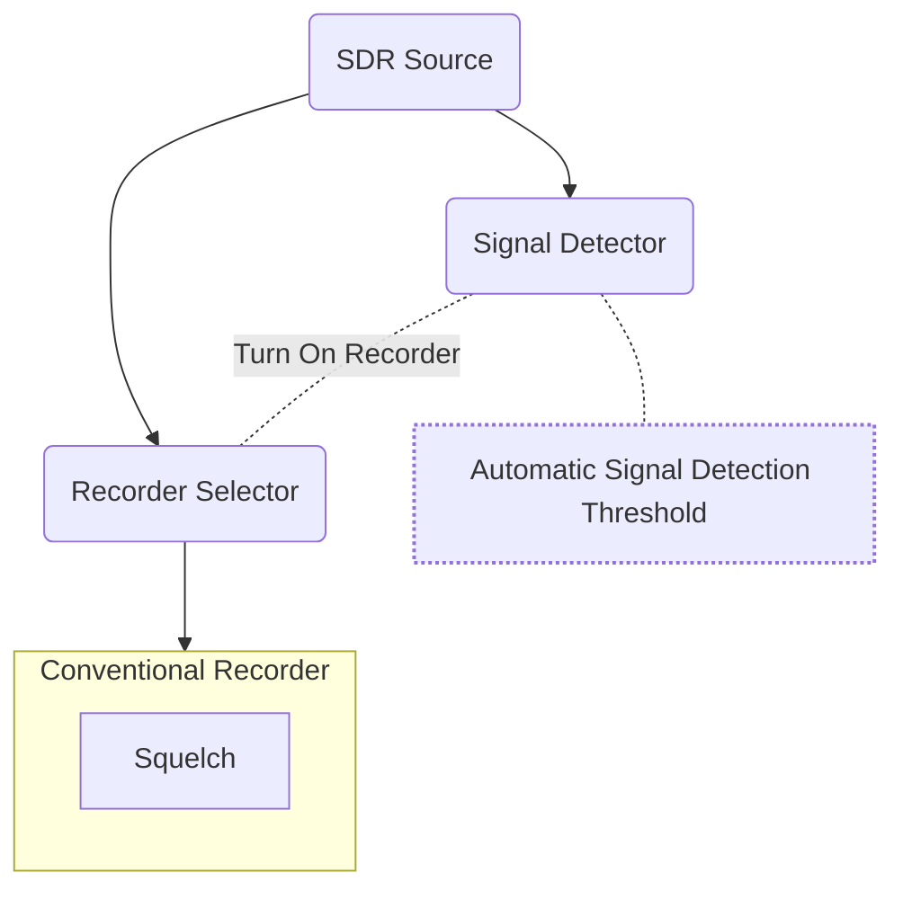

# Adjusting Squelch for Conventional Systems



Conventional Systems can use up a lot of CPU. Prior to v5.0, conventional recorders are always "on" waiting for a signal to break squelch. With v5.0 you now have a Signal Detector per source. Its job is to look over the bandwidth for that source and perform an FFT. For each FFT bin that is over a power threshold, it will look for a **Conventional Recorder** that has similar frequencies. If there is a match, it will Enable the recorder in the Souce's Recorder Selector. The Recorder Selector is just a way to determine if a Recorder should receive samples from the Source. In your logs, look for something like `[ 0 ] AnalogC	Enabled - Freq: 855.737500 MHz	 Detected Signal: -63dBM (Threshold: -69dBM)` if you see that, it means that the **Signal Detector** has turned on a conventional recorder. 

The **Signal Detector** automatically tries to find a power threshold to separate signal from noise. It is not perfect. If you are seeing a recorder not turn on when there is a signal, that could be because the Signal Detector threshold is not being set correctly. Or, if the Recorder is always being enabled by the Signal Detector, even when there is not a transmission, that is also a sign that is not automatically being set correctly. You can manually set the Signal Detector Threshold in the `config.json` file. Just to make things more confusing, the power levels used in the Signal Detector are slightly different than the values used for the Squelch. 

Each Conventional Recorder also has a Squelch setting. Once a Conventional Recorder has been enabled and is receiving samples from the source, it will use a Squelch block and only process samples above a certain power level. This prevent noise from being recorded. The Squelch value needs to be hand tuned, and can be set for the entire Conventional System, or per channel.


## Configuring a Conventional System

- Use a visual signal analyzer program, like GQRX to explore the signal you are trying to capture
  - Adjust the gain settings so that you have strong signals without adding a lot of noise. Copy these gain settings into the `config.json` file.
  - Note the Db value for the noise floor. You should set the squelch value to be in between the noise floor value and the the signal peak values.
  - In the `config.json` file you can specify the squelch value for the whole system, or do it channel by channel, or a mix:
  - **System Wide Squelch**
    - `config.json`
      ```json
        {
          "systems": [
          {
              "type": "conventional",
              "squelch": -50 
          }
        }
      ```
  - **Channel Specific Squelch**
      - `config.json`
        ```json
          {
            "systems": [
            {
                "type": "conventional",
                "channelFile": "channels.csv",
            }
          }
        ```
      - `channels.csv`
        | TG Number | Frequency |  Squelch |
        | --------- | --------- | -------- |
        | 300       | 462275000 | -50 |

        ```csv
        TG Number, Frequency, Squelch
        300, 462275000, -50
        ```
  - **Hybrid Squelch**
      - `config.json`
        ```json
          {
            "systems": [
            {
                "type": "conventional",
                "channelFile": "channels.csv",
                "squelch": -50
            }
          }
        ```
      - `channels.csv`
        | TG Number | Frequency |  Squelch |
        | --------- | --------- | -------- |
        | 300       | 462275000 | -70 |
        | 301       | 462300000 |  |

        ```csv
        TG Number, Frequency, Squelch
        300, 462275000, -70
        301, 462300000, 
        ```

## Debugging a Conventional System

- ### The Channels for a System are never being recorded
  - Try setting the squelch value to something very low, like -100. This should cause the Recorder to always be on and recording. When you quit trunk-recorder you should have a long file, possibly of static. If you, it is possible that the Signal Detector is not working correctly. 
- ### Signal Detector is not working correctly
  - IF you are not seeing a line like: `[ 0 ] AnalogC	Enabled - Freq: 855.737500 MHz	 Detected Signal: -63dBM (Threshold: -69dBM)` and you know there is a transmission on that frequency, it is a sign the the threshold for the Signal Detector is not being set correctly. To test this out, manually set the signal detector threshold in the `sources: [{}]` section of the config.json file. 

    ```json
        "sources": [
          {
            "center": 851734375,
            "rate": 2000000,
            "driver": "osmosdr",
            "signalDetectorThreshold": -100
        }]
    ```
  This will effectively leave all of the recorders enabled all the time... which is not the most efficient. If this does work, then try to find a value for the `signalDetectorThreshold` that works reliably. RF power is measured differently between the Signal Detector and the Squelch block. You may need to use a value roughly 10 dB higher for the Signal Detector. Ideally, you only want the Signal Detector to enable a recorder when a there is a transmission that would trigger the squelch block in the Recorder.