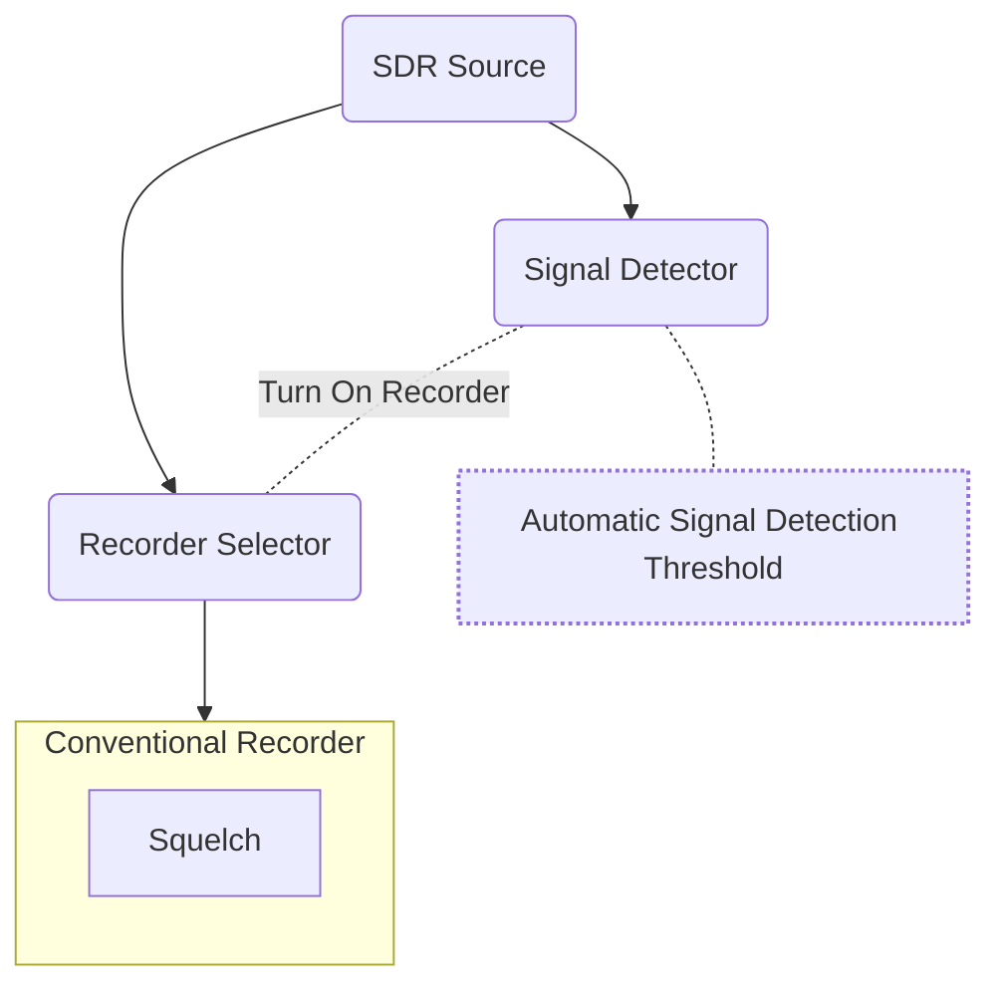

# Adjusting Squelch for Conventional Systems

Conventional Systems can use up a lot of CPU. Prior to v5.0, conventional recorders are always "on" waiting for a signal to break squelch. With v5.0 you now have a Signal Detector per source. Its job is to look over the bandwidth for that source and perform an FFT. For each FFT bin that is over a power threshold, it will look for a **Conventional Recorder** that has similar frequencies. If there is a match, it will Enable the recorder in the Souce's Recorder Selector. The Recorder Selector is just a way to determine if a Recorder should receive samples from the Source. In your logs, look for smoething like `[ 0 ] AnalogC	Enabled - Freq: 855.737500 MHz	 Detected Signal: -63dBM (Threshold: -69dBM)` if you see that, it means that the **Signal Detector** has turned on a conventional recorder. 

The **Signal Detector** automatically tries to find a power threshold to separate signal from noise. It is not perfect. If you are seeing a recorder not turn on when there is a signal, that could be because the Signal Detector threshold is not being set correctly. Or, if the Recorder is always being enabled by the Signal Detector, even when there is not a transmission, that is also a sign that is not automatically being set correctly. You can manually set the Signal Detector Threshold in the `config.json` file. Just to make things more confusing, the power levels used in the Signal Detector are slightly different than the values used for the Squelch. 

Each Conventional Recorder also has a Squelch setting. Once a Conventional Recorder has been enabled and is receiving samples from the source, it will use a Squelch block and only process samples above a certain power level. This prevent noise from being recorded. The Squelch value needs to be hand tuned, and can be set for the entire Conventional System, or per channel.

## Configuring a Conventional System

- Use a visual signal analyzer program, like GQRX to explore the signal you are trying to capture
  - Adjust the gain settings so that you have strong signals without adding a lot of noise. Copy these gain settings into the `config.json` file.
  - Note the Db value for the noise floor. This is the 

Things to try:

- Use GQRX to fine tune gain. Turn off AGC
- Set Signal Detector Threshold to something high like -10 so that recorders are always enabled.
- Set sequelch value for the recorders so that it starts and stop predictably
- remove Signal Detector Threshold and see if the automatic setting works
- if auto doesn't work, fine tune the Signal Detector threshold so that it only displays the Enabled when a recording starts

I will try to write up some guide on doing this