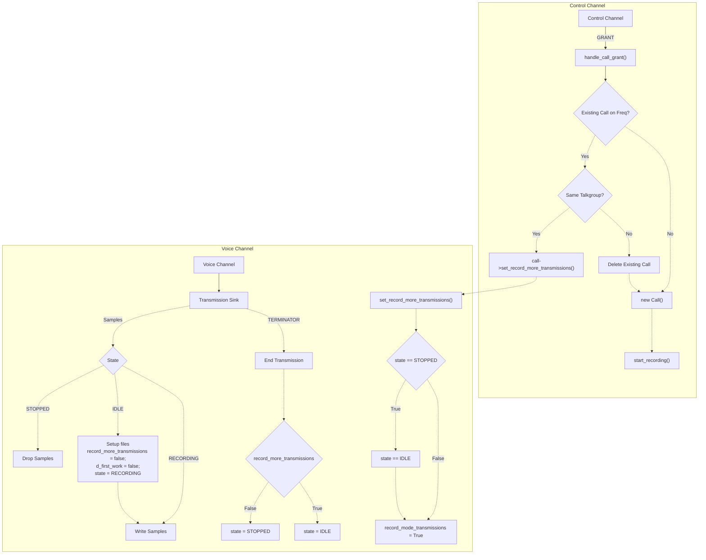
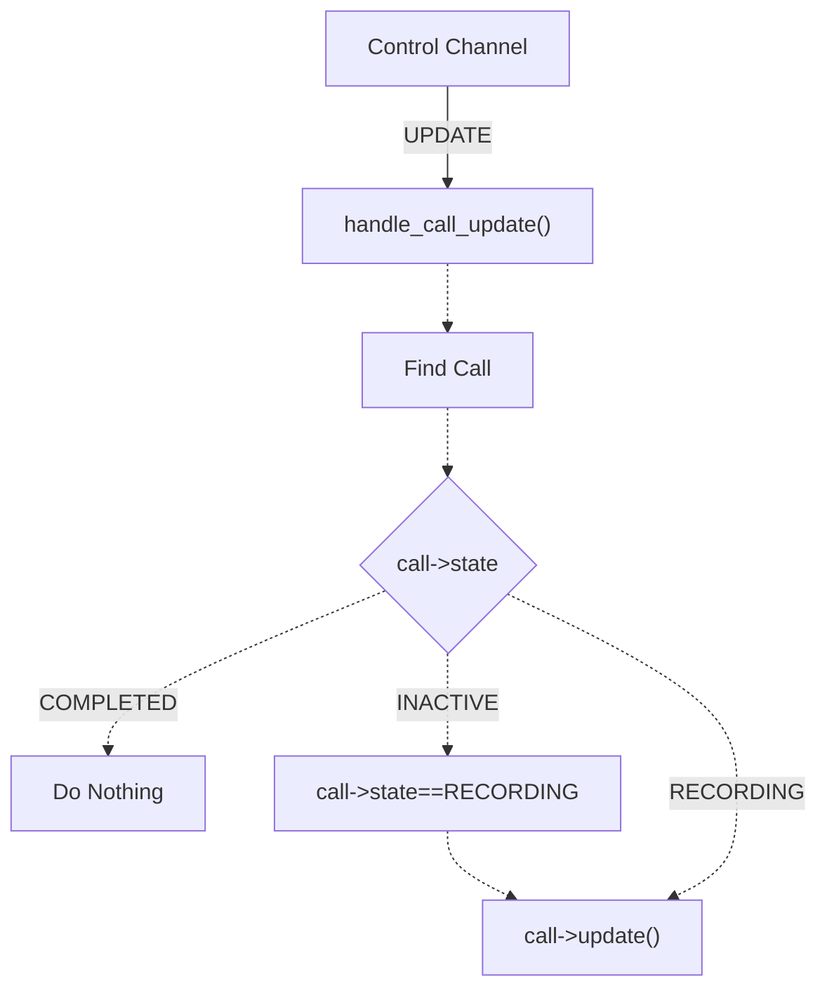

```mermaid
flowchart TD
    E -.-> L1
    subgraph Control Channel
    A[Control Channel] -->|GRANT| B["handle_call_grant()"]
    B --> C{Existing Call on Freq?}
    C -.->|Yes| D{Same Talkgroup?}
    C -.->|No| G["new Call()"]
    D -.->|Yes| E["call->set_record_more_transmissions()"]
    D -.->|No| F[Delete Existing Call]
    F -.-> G
    G -.-> H["start_recording()"]

    end
    subgraph Voice Channel
    A1[Voice Channel] --> B1[Transmission Sink]
    B1 -.->|Samples| C1{State}
    C1 -.->|STOPPED| D1[Drop Samples]
    C1 -.->|IDLE| F1["Setup files\nrecord_more_transmissions = false;\nd_first_work = false;\nstate = RECORDING"]
    C1 -.->|RECORDING| G1[Write Samples]
    F1 -.-> G1
    B1 -.->|TERMINATOR| H1["End Transmission"]
    H1 -.-> I1{"record_more_transmissions"}
    I1 -.->|False| J1["state = STOPPED"]
    I1 -.->|True| K1["state = IDLE"]
    L1["set_record_more_transmissions()"] -.-> N1{state == STOPPED}
    N1 -.->|True| O1["state == IDLE"]
    N1 -.->|False| P1["record_mode_transmissions = True"]
    O1 -.-> P1
    end
    

```

```mermaid
flowchart TD
A[Control Channel] -->|UPDATE| B["handle_call_update()"]
B -.-> C[Find Call]
C -.-> D{"call->state"}
D -.->|COMPLETED| E[Do Nothing]
D -.->|INACTIVE| F["call->state==RECORDING"]
F -.-> G["call->update()"]
D -.->|RECORDING| G

```
