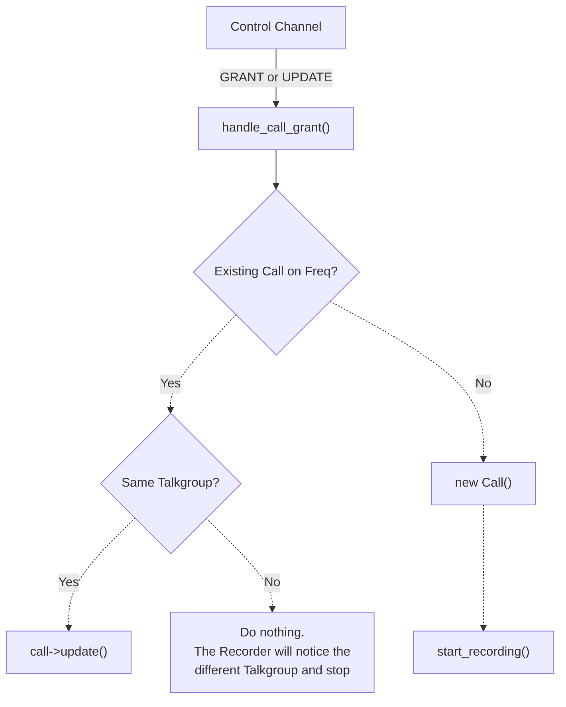
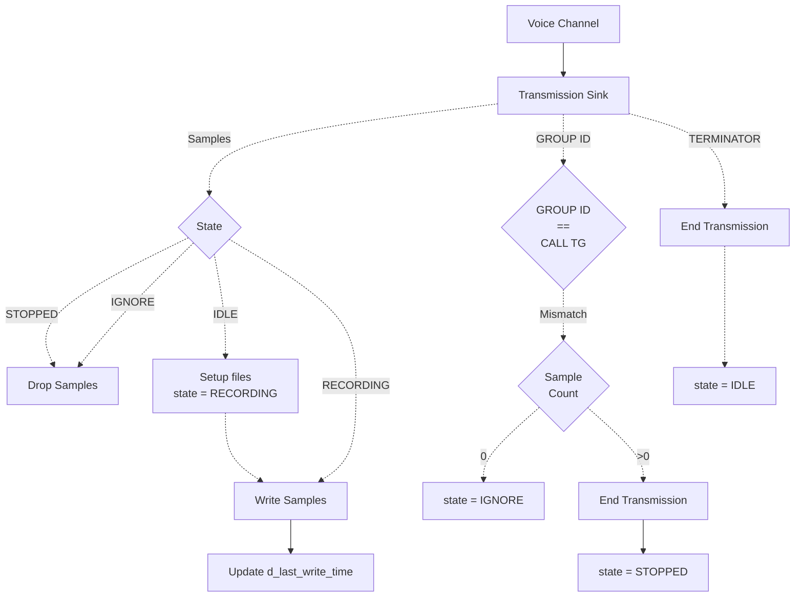
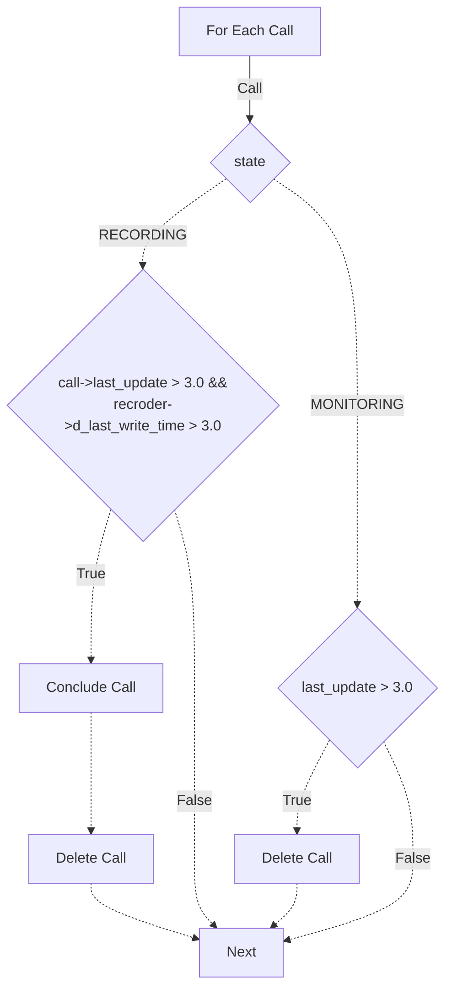

Use [Mermaid Live](https://mermaid.live/) to edit the charts.

```mermaid
flowchart TD
A[Control Channel] -->|GRANT or UPDATE| B["handle_call_grant()"]
B --> C{Existing Call on Freq?}
C -.->|Yes| D{Same Talkgroup?}
C -.->|No| G["new Call()"]
D -.->|Yes| E["call->update()"]
D -.->|No| F[Do nothing.\n The Recorder will notice the \ndifferent Talkgroup and stop]
G -.-> H["start_recording()"]
```

```mermaid
flowchart TD
A1[Voice Channel] --> B1[Transmission Sink]
B1 -.->|Samples| C1{State}
B1 -.->|GROUP ID| V1{GROUP ID \n==\nCALL TG}
V1 -.->|Mismatch|Q1{Sample\nCount}
Q1 -.->|0| R1[state = IGNORE]
Q1 -.->|>0| S1[End Transmission]
S1 --> T1[state = STOPPED]
C1 -.->|STOPPED| D1[Drop Samples]
C1 -.->|IGNORE| D1
C1 -.->|IDLE| F1["Setup files\nstate = RECORDING"]
C1 -.->|RECORDING| G1[Write Samples]
G1 --> U1[Update d_last_write_time]
F1 -.-> G1
B1 -.->|TERMINATOR| H1["End Transmission"]
H1 -.-> K1["state = IDLE"]
```
    

```mermaid
flowchart TD
A[For Each Call] -->|Call| B{state}

B -.->|RECORDING| C{call->last_update > 3.0 &&\nrecroder->d_last_write_time > 3.0}  
C -.->|True| H["Conclude Call"]
C -.->|False| D[Next]
B -.->|MONITORING| F{"last_update > 3.0"}  
F -.->|True| G["Delete Call"]
G -.-> D
F -.->|False| D
H -.-> Z["Delete Call"]
Z -.-> D
```
