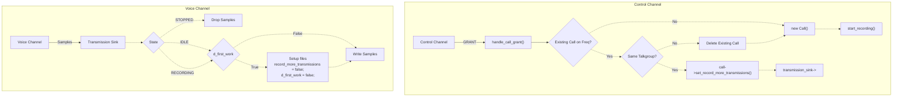

```mermaid
flowchart TD
    subgraph Control Channel
    A[Control Channel] -->|GRANT| B["handle_call_grant()"]
    B --> C{Existing Call on Freq?}
    C -.->|Yes| D{Same Talkgroup?}
    C -.->|No| G["new Call()"]
    D -.->|Yes| E["call->set_record_more_transmissions()"]
    D -.->|No| F[Delete Existing Call]
    F -.-> G
    G -.-> H["start_recording()"]
    E -.-> I["transmission_sink->"]
    end
    subgraph Voice Channel
    A1[Voice Channel] -->|Samples| B1[Transmission Sink]
    B1 -.-> C1{State}
    C1 -.->|STOPPED| D1[Drop Samples]
    C1 -.->|IDLE| E1{d_first_work}
    C1 -.->|RECORDING| E1
    E1 -.->|True| F1["Setup files\nrecord_more_transmissions = false;\nd_first_work = false;"]
    E1 -.->|False| G1[Write Samples]
    F1 -.-> G1
    end
    

```
